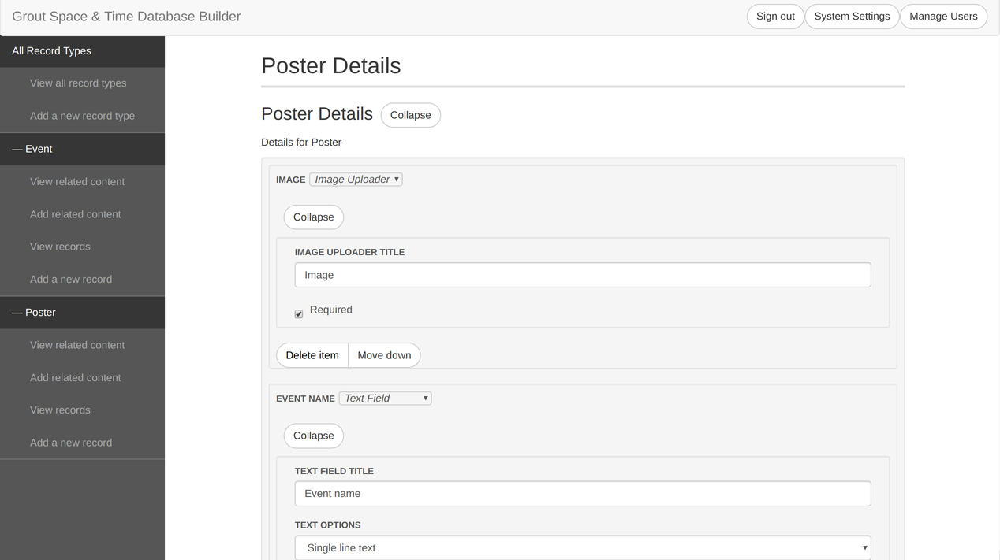
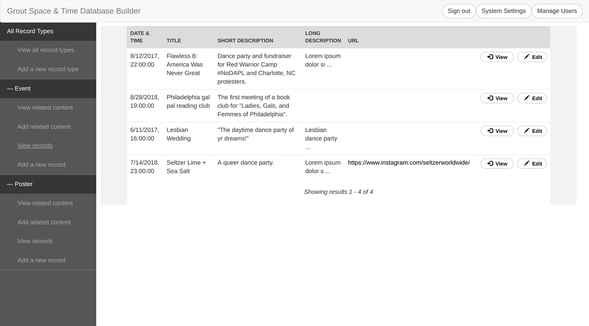
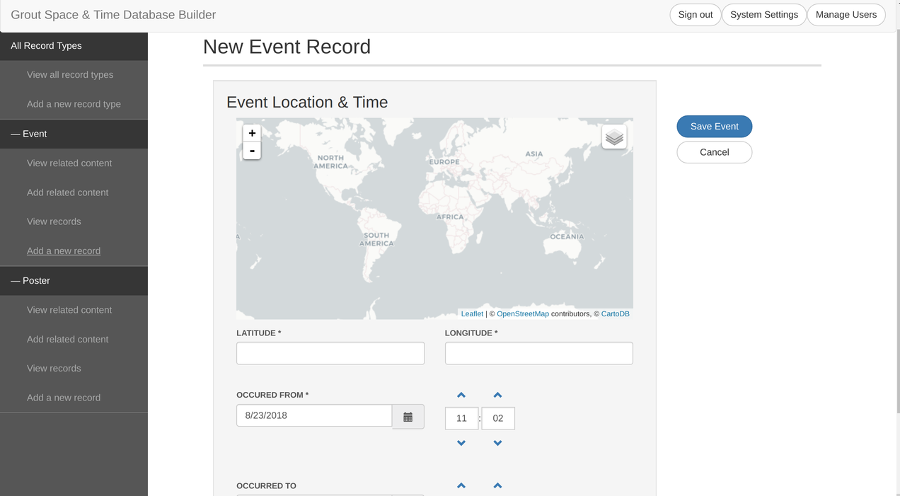

# Grout Schema Editor

[](https://travis-ci.org/azavea/grout-schema-editor)

Grout Schema Editor is a simple, static admin portal providing a web interface to
a [Grout](https://github.com/azavea/grout) database server.

With Grout Schema Editor, you can **manage records and schemas for a Grout project**
entirely from the web -- no code required.

## Contents

- [**Demo**](#demo)
- [**Usage**](#usage)
    - [Installation](#installation)
    - [Configuration](#configuration)
    - [A note on "related content"](#a-note-on-related-content)
- [**Developing**](#developing)
    - [Requirements](#requirements)
    - [Installation](#installation-1)
    - [Testing](#testing)

## Demo

Edit the schema of a record:



Preview the new schema as a data collection form:


View a list of all available records in a RecordType:



Add a new record:



## Usage

### Installation

This guide covers installing and configuring a Grout Schema Editor instance
in your project. Note that Grout Schema Editor assumes that you already have
a Grout API server installed. For instructions on how to set up a Grout
server, see the [Getting started](https://github.com/azavea/grout#getting-started)
section of the Grout documentation.

To incorporate the Grout Schema Editor into a project that uses Grout, clone
this repo into the directory containing your project:

```bash
# Run this command in your project directory.
$ git clone git@github.com:azavea/grout-server.git
```

Next, copy and edit the example config file to match the requirements of your project.

```bash
# Move the example config file into the app directory.
cp example/config.js app/scripts/config.js
```

### Configuration

The default config values in `app/scripts/config.js` should be fine for most applications, with
the exception of `config.api.hostname`, which will likely need to be changed in order
to match the URI of your Grout database server instance.

Configuration attributes live inside the `config` object in `app/scripts/config.js`.
Available configuration attributes include:

| Attribute name | Type | Description |
| -------------- | ---- | ----------- |
| `debug` | Boolean | Whether or not this is a development instance of the application. |
| `html5Mode` | Object | Configuration settings for AngularJS's [`$locationProvider` provider](https://docs.angularjs.org/api/ng/provider/$locationProvider). |
| `html5Mode.enabled` | Boolean | Whether or not to enable HTML5. Controls the [`$locationProvider.html5Mode` setting](https://docs.angularjs.org/api/ng/provider/$locationProvider#html5Mode) in AngularJS. |
| `html5Mode.prefix` | String | Prefix for the hash portion of the URL. Controls the [`$locationProvider.hashPrefix` setting](https://docs.angularjs.org/api/ng/provider/$locationProvider#hashPrefix) in AngularJS. |
| `api` | Object | Configuration settings for the Grout API. |
| `api.hostname` | String | Root URL where your API is accessible. Note that this URL should **not** include the standard `/api/` prefix that Grout uses. For example, if your API root is `https://hostname.com/grout/api`, you should configure this setting to `'https://hostname.com/grout'`. |
| `api.groups` | Object | Configuration settings for the authentication groups in your Grout API server. |
| `api.groups.admin` | String | Name of the admin authentication group in your Grout API server. Corresponds to the `USER_GROUPS['ADMIN']` setting in [Grout Server](https://github.com/azavea/grout-server). |
| `api.groups.readOnly` | String | Name of the public (read-only) authentication group in your Grout API server. Corresponds to the `USER_GROUPS['READ_ONLY']` setting in [Grout Server](https://github.com/azavea/grout-server). |
| `api.groups.readWrite` | String | Name of the staff (read-and-write) authentication group in your Grout API server. Corresponds to the `USER_GROUPS['READ_WRITE']` setting in [Grout Server](https://github.com/azavea/grout-server). |
| `record.limit` | Number | Default number of Records to retrieve from the API for any `GET` request. |
| `localization.timeZone` | String | The timezone of this application. Should be formatted as a [tz database timezone identifier](https://en.wikipedia.org/wiki/List_of_tz_database_time_zones). |

### A note on "related content"

The schema editor uses the term "related content" to refer to a _form_ contained on a RecordType. Related content allows you to namespace fields, so that if you had, say, a `Cat` RecordType and you wanted to store information about the `Owner`, you could have a `Cat Details` related content form and an `Owner` related content form, and each form could have a separate `name` field without confusing Grout.

In the data collection views (`Add/Edit Records`), each related content will show up as a separate editable form.

By default, every new RecordType will be created with a `<RecordType> Details` related content form. If you plan to store large data like Images on Records, the `Details` form can sserve as a good place to store simple metadata about a Record, since the Grout API lets you query only for Record details using the `details_only` query parameter. For more information, see the [Grout API documentation](https://github.com/azavea/grout#api-documentation).

## Developing

### Requirements

The Grout Schema Editor is containerized with Docker to ensure similar
environments across platforms. In order to develop Grout Schema Editor with Docker, you need the
following dependencies:

- [Docker CE Engine](https://docs.docker.com/install/) >= 1.13.0 (must be
  compatible with [Docker Compose file v3
  syntax](https://docs.docker.com/compose/compose-file/#compose-and-docker-compatibility-matrix))
- [Docker Compose](https://docs.docker.com/compose/install/)

### Installation

Clone the repo with git.

```bash
$ git clone git@github.com:azavea/grout.git
$ cd grout
```

Run the `update` script to set up your development environment.

```bash
$ ./scripts/update
```

### Testing

If you'd like to contribute to Grout Schema Editor, you can run tests using the
`test` script located in the `scripts` directory.

```bash
$ ./scripts/test
```

The test suite uses Karma to run tests using a headless Chrome browser. By
default, it will only run tests once before stopping the test server. If you
need to debug a test failure, you can keep the test server running by setting
the Karma `singleRun` flag to `false` in `Gruntfile.js`.

```javascript
// Gruntfile.js

karma: {
  unit: {
      configFile: 'test/karma.conf.js',
      singleRun: false
  }
}
```

Edit `docker-compose.yml` to expose the port that the test server is running
on.

```yml
# docker-compose.yml

services:
  editor:
    ...
    ports:
      - "9000:9000"
      - "35731:35731"
      - "9001:8080"  # Bind port 8080 in the container to port 9001 on your machine
```

Navigate to the host that is listening to the test server (in this case,
`localhost:9001`) and hit the `DEBUG` button in the top-right corner to run
the tests in a browser window. Then, you can use your browser's debug tools
to debug the tests.

For tips on debugging Karma tests, see Gleb Bahmutov's [Debugging
Karma Unit Tests](https://glebbahmutov.com/blog/debugging-karma-unit-tests/)
blog post.
